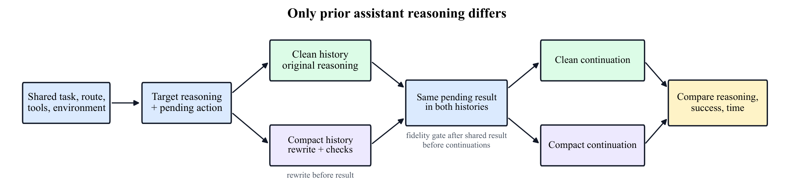

# [Why Pay for Long Reasoning When Rewrite Do Trick?](paper.pdf)

## TL;DR

Compact rewrites of earlier reasoning can make models generate fewer reasoning tokens without retraining, with model-dependent savings in software agents.

## Abstract

Reasoning substantially improves language models' ability to solve difficult problems, but long reasoning traces make these gains expensive. Efficient reasoning should express useful analysis in fewer tokens by reducing repetition and text that adds little value to solving the problem. Progress in proprietary models motivates this goal, yet their hidden scratchpads limit direct study of how it is achieved. We investigate whether open-weight models can generate less verbose reasoning by changing the form of their own earlier thoughts, without retraining. Our intervention rewrites prior reasoning into compact state records before pending tool results are revealed, then compares continuations from original and compact histories. Across the tested models, accepted compact histories usually shorten future reasoning; a coding case study also shows less repeated verification after a shared candidate solution. In software-agent deployments, compaction can reduce total spending, although task quality and rewrite-inclusive time depend on the target and compressor. These findings identify reasoning history as one way to reduce future reasoning-token use and motivate model-specific compaction policies evaluated for both efficiency and retained capability.

